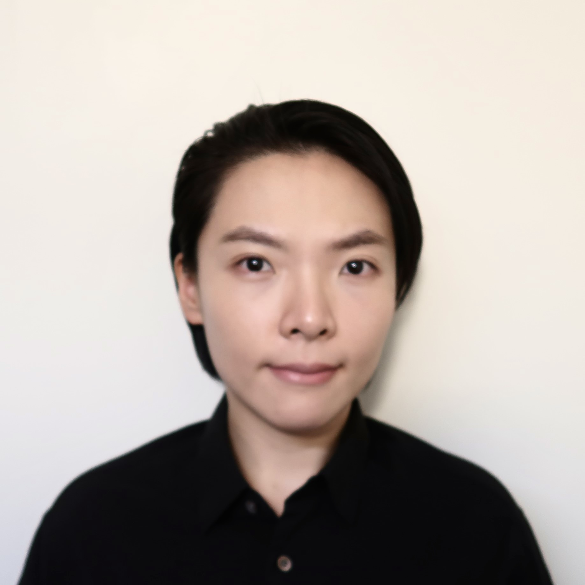

  

    
    

      
      <a href="https://www.linkedin.com/in/xinhez/" style="font-size: 16px; margin-left: 5px; text-decoration: none; white-space: nowrap;">Connect with me</a>
    

    

      xinhez [at] alumni.cmu.edu
    

  

  

    I am a PhD candidate at Harvard University, where my research bridges AI and the life sciences. My work has evolved from applying AI to biological data toward exploring its role in biomedical research and applications. Prior to my doctoral studies, I worked in the tech industry on product development and marketing analytics. Looking ahead, my goal is to advance the integration of biological systems and AI, driving translational impact through technologies that bridge fundamental discovery and real-world application.
  

